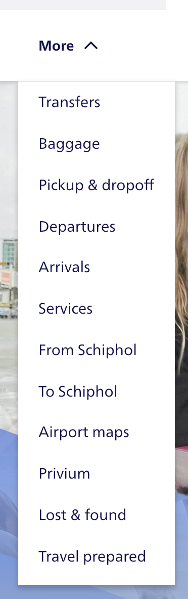
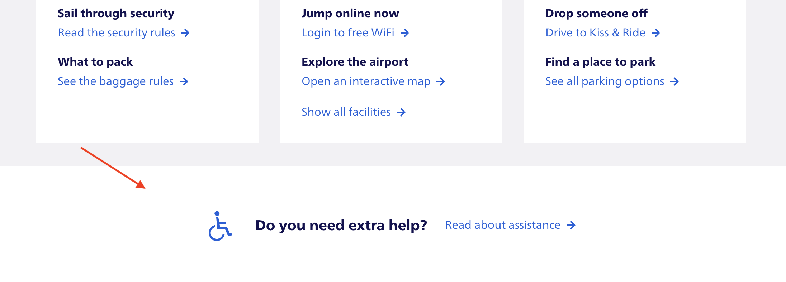

# Analyzing the Schiphol Website on Accessibility

# Table of Contents
- [Introduction](#introduction)
- [Skip to content](#skip-to-content)
- [Color contrast](#color-contrast)
- [Focus states](#focus-states)
- [Easy help navigation](#easy-navigation-to-help)
- [Conclusion](#conclusion)

## Introduction

On Wednesday march 28th we visited Schiphol to attend a lecture on accessibility given by Ischa Gast.

Ischa isnt shy to talk about his love for accessibility and you can really tell he has a passion for what he does.

Online on Twitter, he offers companies 'free advice' when those companies dont pay enough attention to accessibility.

It seemed like a fun idea to me to analyse the Schiphol website, the same website and company where Ischa works, to see what he has done and to see if he follows his own guidelines.

## Skip to content

Here we can see that tabbing reveals a hidden menu! Hitting enter or clicking on this menu will scroll you down to the main content of the page.

## Color contrast

Ischa had a very fancy app to verify if color contrasts work well together.

The results are pretty good.

Perfect

Perfect

Hmmmmm?

The contrast between the background and the container is terrible. Probably not too important but still funny to see.

## Focus states

Focus will reveal a dotted line around the element.

Same goes for this menu

When hitting enter, the focus returns to the top menu element.

## Easy navigation to help

I find it very nice that the website shows the 'Do you need extra help' right there at the bottom of the homepage. It's very clear and inviting for the demographic to notice this and make use of it.

## Conclusion

Ischa has done exactly what he preached. The Schiphol website looks lovely and it's very friendly to navigate through. I wonder how much of this was Ischa and how much of it was the designers. Did they work together, was Ischa heavily involded, did the design team come up with the colors themselves or did Ischa take the lead?

The website looks beautiful and it's very welcoming to all people. It makes me curious as to what else Ischa thinks needs to be improved.