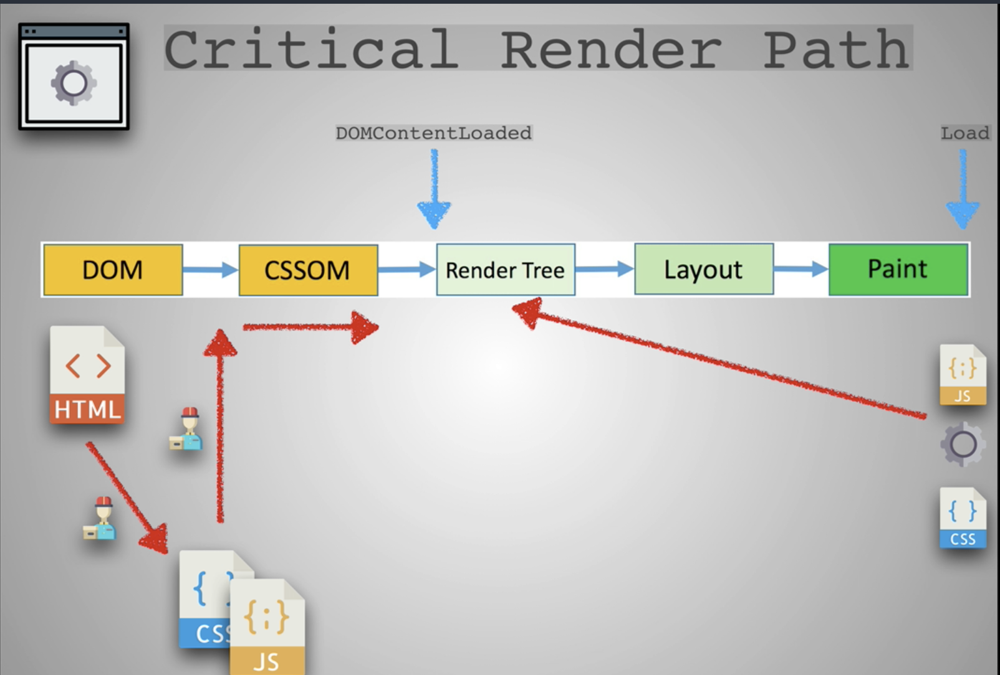
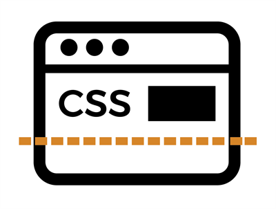
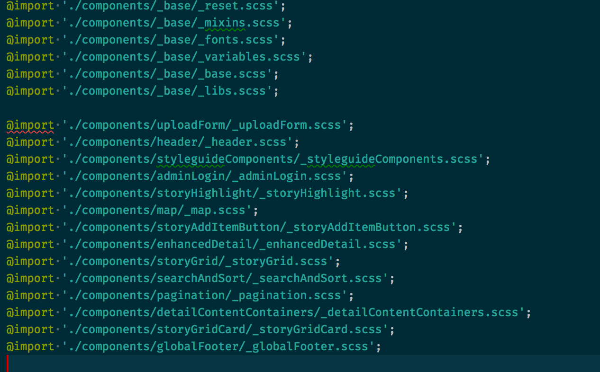
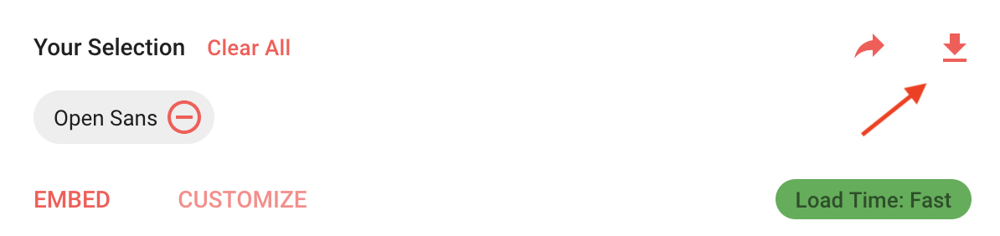

# Optimising Performance

# Table of Contents
- [Introduction](#introduction)
- [Optimising CSS](#optimising-css)
- [Loading content Asynchronously](#loading-content-asynchronously)
- [Critical CSS](#critical-css)
- [Loading Fonts Asynchronously](#loading-fonts-asynchronously)
- [Conclusion](#conclusion)

## Introduction

In this article, I want to talk about how I optimised performance for the final project of the minor I am attending.

I personally think people are underestimating how much of an effect loading times have on keeping your end users happy and visiting often.

According to an article by Google, [websites that load within 5 seconds had a 70% higher user sessions, 35% lower bounce rates and 25% higher ad viewability.](https://developers.google.com/web/fundamentals/performance/why-performance-matters/)

In short, we want to deliver the smallest file sizes possible and have the content show as soon as possible.



This image shows that at the beginning JS and CSS get downloaded and parsed (assuming the Javascript has been put in the head) and that it can delay the rendering.

## Optimising CSS

We wrote a lot of CSS. By simply building our main CSS file, we end up with a file that's about 23 kb's.

Keep in mind that the rules look like this
```css
autocomplete {
	position: relative;
}

.autocomplete ul {
	position: absolute;
	bottom: 0;
	left: 0;
	transform: translateY(100%);
	z-index: 1;
}
```

I applied a process called uglifying, which makes the code look like this;

```css
.autocomplete{position:relative}.autocomplete ul{position:absolute;bottom:0;left:0;-ms-transform:translateY(100%);transform:translateY(100%);z-index:1}.autocomplete li{border:1px solid #000;border-bottom-width:0}
```

As you can see, it put everything on a single sentence and remove any whitespace. Next to making the code ugly, it also saved a lot of kb's by doing this!

This process made the file go from 23 kb's to 16 kb's. That's a win of 7 kb's.

This same process can be done for Javascript. This made our Javascript go from **314 kb's to 54 kb's!**

## Loading content Asynchronously

### CSS

Normally, the browser finds the .css file and starts downloading, building the CSS object model and applying the CSS rules to the structure. [We want to optimise performance so we want the CSS downloading and executing without stopping the content from being loaded.](https://developers.google.com/web/fundamentals/performance/critical-rendering-path/render-blocking-css)

In the case of CSS, it's actually really easy to do this.

Usually, when linking a .CSS file, you do this;

```html
<link rel='stylesheet' href='index.css'>
```

For modern browsers, you can do this;

```html
<link rel="preload" href="index.css" as="style" onload="this.onload=null;this.rel='stylesheet'">
```

There is a polyfill available for the browsers that don't support this yet [right here.](https://github.com/filamentgroup/loadCSS/blob/master/src/cssrelpreload.js)

And just to be safe;

```html
<noscript><link rel="stylesheet" href="/styles/index.css" ></noscript>
```

### Javascript

Javascript files are blocking. It's the whole reason why we don't put it in the ```head```. We always put it before the last closing ```body``` tag.

```html
<body>
    ...
    <script src="script.js">
    ....
</body>
```

Now, we have extra features for browsers that support it. These only work for external .js files.

```html
<script async src="script.js">
```


This is how it normally works, the browser sees your file, stops everything else, reads and executes code, and then continues reading. This is what we call blocking.

---


```html
<script async src="script.js">
```


Async tells the browser that the browser does not need to stop, download and execute the code. It can simply continue reading html and downloading the JS file at the same time. Once the JS file is downloaded,it will briefly pause the HTML to execute the code.

---


```html
<script defer src="script.js">
```


Defer is almost the same as Async, the browser will download the Javascript file and keep reading the html at the same time. The big difference is that the Javascript will always be executed at the end, when the HTML is done loading.

The general consensus is to use async whenever the Javascript does not do any DOM manipulation, and defer anywhere else. Also, browsers that don't understand ```async``` or ```defer``` will simply read over the code. It won't crash.

Source: [Bits of Code](https://bitsofco.de/async-vs-defer/)

## Critical CSS

So, now your website is loading extremely quickly. Super quick. But that's not perfect, because it means your users will see a flash of pure html for less than a second. That's not cool. So what can we do?

First, we need to understand what above the fold css is.



Source: [C2Experience](https://c2experience.com/media/97843/foldgraphic3x_400x302.jpg)

Above the fold css is all the css that you see at the top of your page till the bottom of your visible screen. Knowing this we now know what CSS we should display first.

There are a lot of websites and tools that do this for you, [such as this website that looks at your html and grabs the relevant CSS.](https://jonassebastianohlsson.com/criticalpathcssgenerator/)

In our case, we simply looked at the components and created our own critical.css file containing the css needed.



This little file generated the css code that we determined to be above the fold css.

### Where does it go?

Well, in the ```head```. I had to setup a system on the back-end, but to keep this segment short and sweet, we will assume it's purely client side.

Here is an example of what placing the critical css looks like;

```html
	<style>
	.autocomplete{position:relative}.autocomplete ul{position:absolute;bottom:0;left:0;-ms-transform:translateY(100%);transform:translateY(100%);z-index:1}.autocomplete li{border:1px solid #000;border-bottom-width:0}
	</style>
```

It's important to note that the whole point of doing this is to put it in a ```style``` tag. We don't want an external file, we want this code executed as soon as possible.

## Loading fonts Asynchronously

Google Fonts is an incredibly useful resource for free, good performing fonts.

Usually, you put it in the head like so;

```html
<link href="https://fonts.googleapis.com/css?family=Open+Sans" rel="stylesheet">
```

You might have guessed it, but this is also blocking. Not good.

For our project, I downloaded the font through Google and put it in a folder in our project.



In the CSS, I gave the website a few fallback fonts, the main font is Open Sans and the fallbacks are such as Arial.

Then, I wrote some code like so;

```css
@font-face {
	font-family: 'Open Sans';
	src: url('../fonts/OpenSans-Bold.woff2') format('woff2'), url('../fonts/OpenSans-Bold.woff') format('woff');
	font-weight: bold;
	font-style: normal;
	font-display: swap;
}
```

This will load the font, but the real beauty is in the ```font-display: swap;``` rule. This tells the browser to use a fallback font until the main font has been loaded, at which the browser will perform a swap. It helps if your fallback font is quite similar to your main font.

## Conclusion

This was a lot of frigging work, but in the end we managed to have a website that is extremely performant, being able to load in 1 second on average.