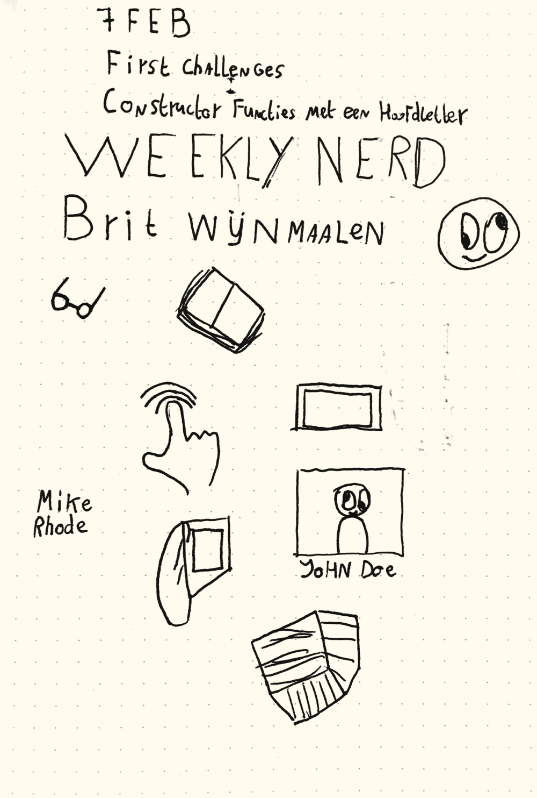
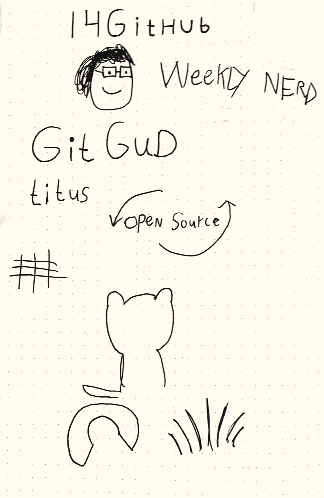
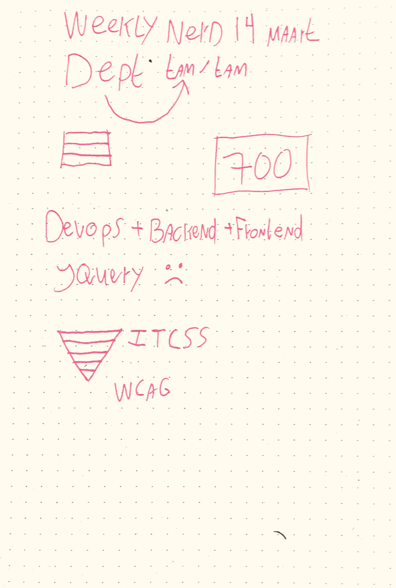
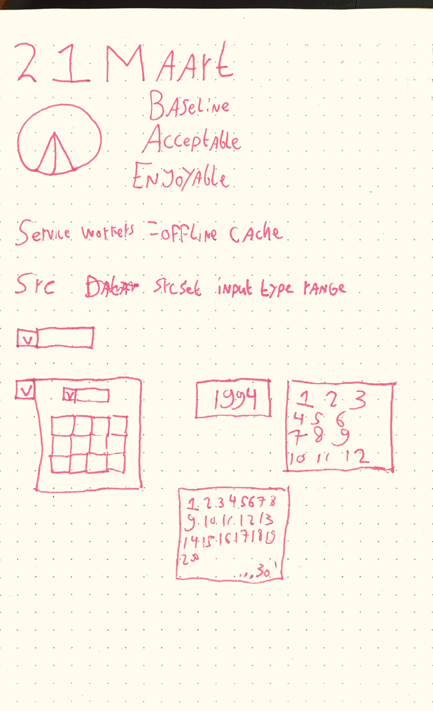
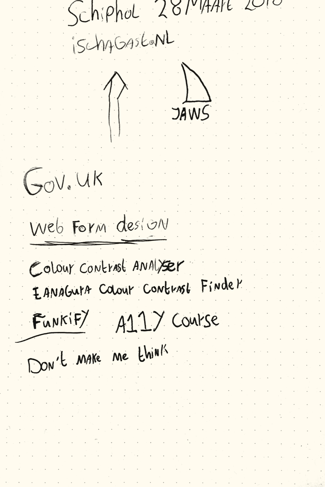
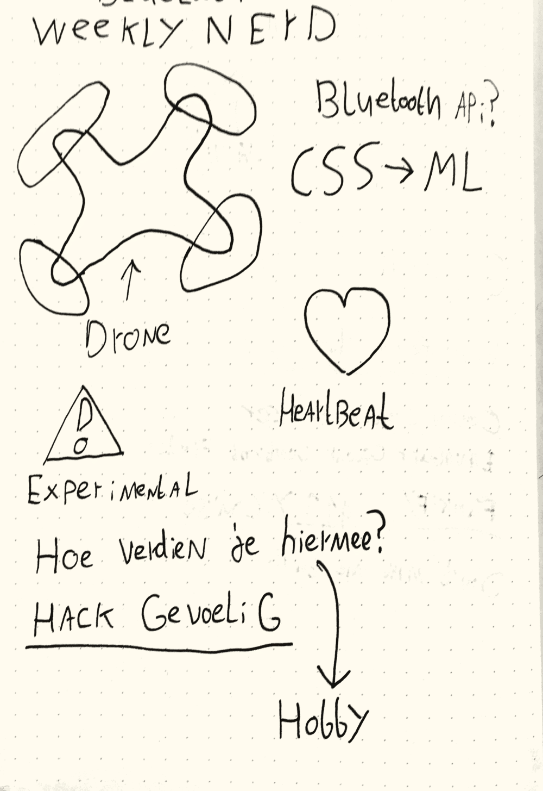
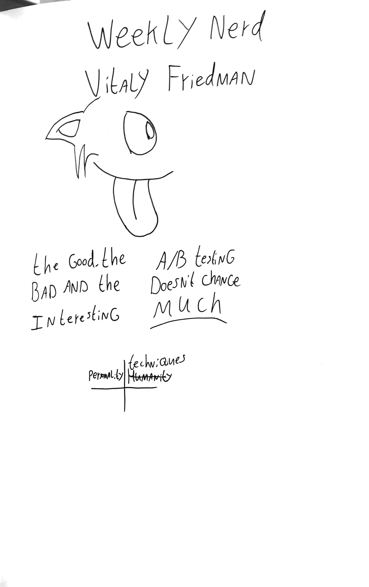
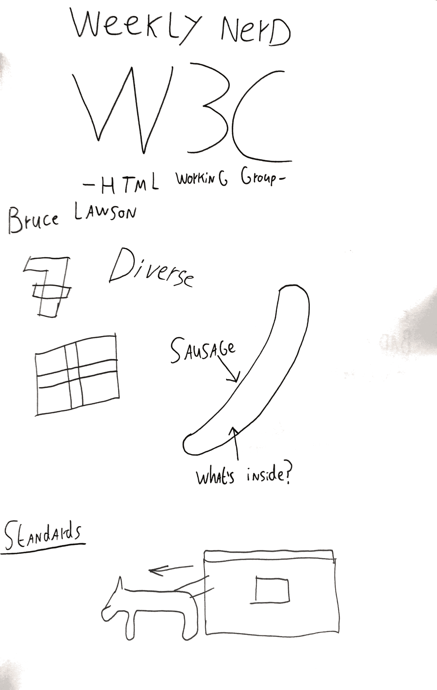
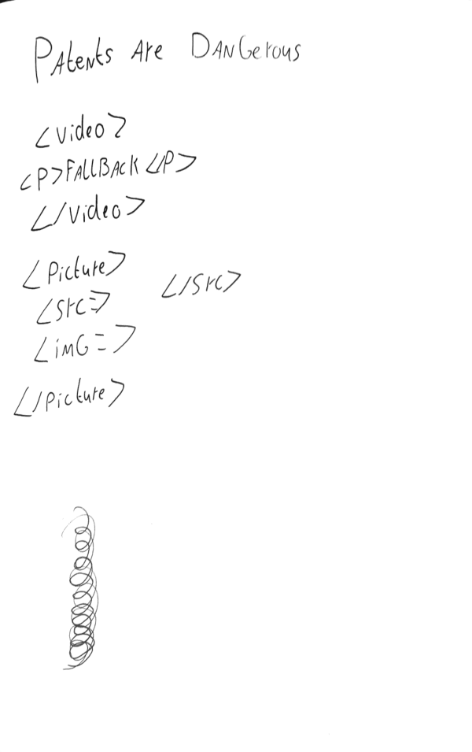

# The 5 articles

[Tooling - Babel](https://github.com/moniac/weekly-nerd/blob/master/TOOLING.md)

[The impact of tooling](https://github.com/moniac/weekly-nerd/blob/master/IMPACT-OF-TOOLING.md)

[Accessibility analyis on the Schiphol Website](https://github.com/moniac/weekly-nerd/blob/master/ACCESSIBILITY-ANALYSIS-SCHIPHOL.md)

[The health risks of sitting too long](https://github.com/moniac/weekly-nerd/blob/master/HEALTH-RISKS-SITTING-TOO-LONG.md)

[Optimising Performance](https://github.com/moniac/weekly-nerd/blob/master/OPTIMISING-PERFORMANCE.md)

# The sketch notes

## Brit Wijnmaalen - Sketchnotes

* Sketch notes are just another way of making notes
* Writing down helps with memorizing
* You can make quick outlines and come back to finish details later

## Titus Wormer - Git

* Git and Github are not one and the same. 
* Git is advanced version control and Github a platform to store the versions
* Open Source makers don't get enough support or love, are prone to people being entitled to their work

## Peter Paul Koch - Browsers

* Big companies have a lot of power
* Apple is kind of a jerk
* It's a lot of work to make a browser engine, that's why chromium is popular
* Everything on the web has to be backwards compatible

## TamTam/Dept

* I really don't like the tech stack
* Looks like a huge company
* Very big difference in teams, separated

## De Voorhoede

* They really enjoy feature detection and starting from a baseline
* Progressive enhancement is huge here
* Baseline - Acceptable - Enjoyment/Pleasurable

## Ischa Gast - Schiphol

* Has a link dump [on his website](https://ischagast.nl/)
* Really loves for accessibility, though I couldn't pinpoint why
* Color contrast analyse tool

## Niels Leenheer

* Bluetooth implementation in the web is still pretty early but really fun
* It doesn't always work and it's susceptible to hacks.

## Hackathon - Missed

## Vitaly Friedman

* You can design with a small idea in mind and use that as your basis
* Being strange is being memorable
* Websites are too boring

## Bruce Lawson

* Everything on the web has to be backwards compatible
* Apple can be a dick sometimes
* Patents sucks