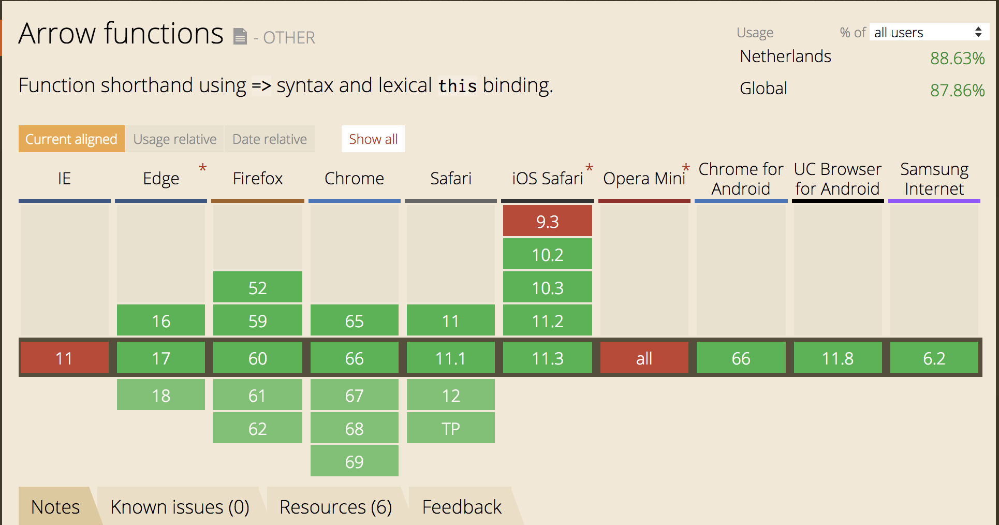
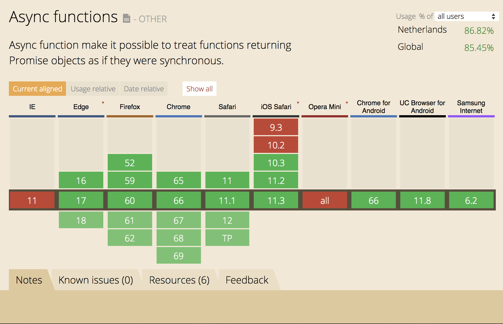

# Tooling - Javascript

# Table of Contents
- [Introduction](#introduction)
- [What will you be able to do at the end?](#what-will-you-be-able-to-do-at-the-end)
- [Setting up babel](#setting-up-babel)

## Introduction

Developers use loving Javascript, and the newest features are all incredibly exciting. However, support for the latest features are not great obviously.




As you can see here, while the support is ok, it's not close to 100%. Newer features will score even lower.

---

I am someone that loves using the newest in advancements, but I have a duty to make sure my excitement doesn't affect my users, who are the most important.


This is where [Babel.js](https://babeljs.io/) comes into play. It allows you to use the latest features and simply compiles it to older versions of Javascript. We will use babel through browserify to get this working.

## What will you be able to do at the end?

You will be able to use ES8 features, but also ```import``` and ```require``` modules.

## Setting up babel

First off, we need to create a package.json which will allow us to save the dependencies and setup our NPM Scripts.

To do this, navigate to an empty folder in your terminal and run;

```
npm init -y
```

This will set you up with a package.json file.

We also need to create a .babelrc file, this file tells babel what configuration it needs to use.

Create the .babelrc file in the same folder as the package.json and paste this in;

```js
{
  "presets": ["env"],
  "plugins": ["transform-async-to-generator", "transform-runtime"]
}
```

---

Second, we need to add the dependencies to the package.json. Since babel is only used while developing, you add it to the devDependencies.

In your terminal run;

```
npm i babel-core babel-plugin-transform-async-to-generator babel-plugin-transform-runtime babel-preset-env babelify browserify -D
```

Your package.json should look like this now;

```json
{
  "name": "Desktop",
  "version": "1.0.0",
  "description": "",
  "main": "index.js",
  "scripts": {
    "test": "echo \"Error: no test specified\" && exit 1"
  },
  "keywords": [],
  "author": "",
  "license": "ISC",
  "devDependencies": {
    "babel-core": "^6.26.3",
    "babel-plugin-transform-async-to-generator": "^6.24.1",
    "babel-plugin-transform-runtime": "^6.23.0",
    "babel-preset-env": "^1.7.0",
    "babelify": "^8.0.0",
    "browserify": "^16.2.2"
  }
}
```

---

Third, it's time to add the scripts!

But before we do that, create a index.js file in your map and add the following code to it;

```js
const a = 1

const addSum = (a, b) => a + b

addSum(2, 4)
```

Then, in your package,json at the ```"scripts"``` part, add this code;

```
"build": "browserify index.js -t babelify -o dist.js"
```

Your package.json should look like this now;

```json
{
  "name": "Desktop",
  "version": "1.0.0",
  "description": "",
  "main": "index.js",
  "scripts": {
    "test": "echo \"Error: no test specified\" && exit 1",
    "build": "browserify index.js -t babelify -o dist.js"
  },
  "keywords": [],
  "author": "",
  "license": "ISC",
  "devDependencies": {
    "babel-core": "^6.26.3",
    "babel-plugin-transform-async-to-generator": "^6.24.1",
    "babel-plugin-transform-runtime": "^6.23.0",
    "babel-preset-env": "^1.7.0",
    "babelify": "^8.0.0",
    "browserify": "^16.2.2"
  }
}

```

---

The final step, in your terminal type;

```
npm run build
```

This will create a dist.js file with all your new code compiled to older code!